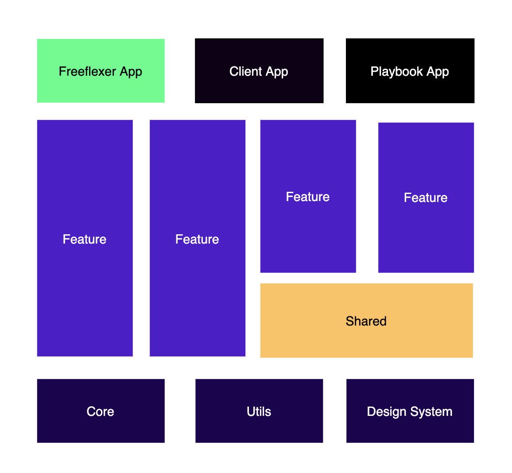
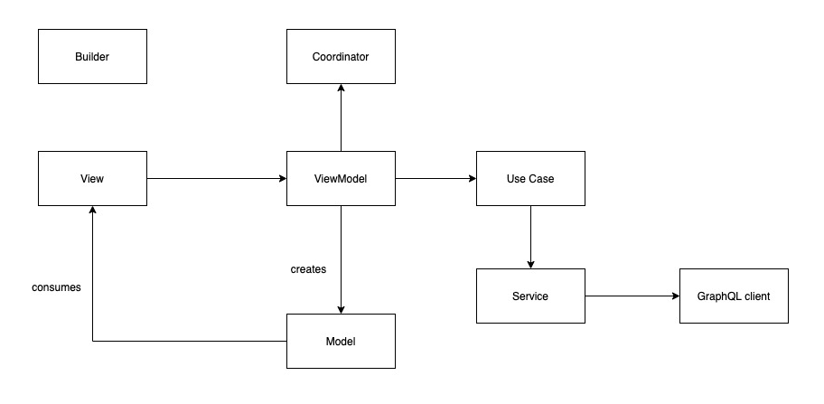

# Temper iOS Architecture

This document describes the current architecture approach for Temper iOS App.

## Holistic App Architecture

The application is structured using modularised architecture In this architecture, the App is separated into totally isolated Feature modules which depend on Shared and Core modules. Having isolated modules so people can work easily in separate cross-functional teams and it's easy to reuse modules as frameworks.



## Module Architecture

Each Module is using a [Model-View-ViewModel (MVVM)](https://en.wikipedia.org/wiki/Model%E2%80%93view%E2%80%93viewmodel) architecture pattern with two additional patterns added:

- [Builder design pattern](https://en.wikipedia.org/wiki/Builder_pattern) - To construct objects and help with dependency management
- [Router pattern](https://www.objc.io/issues/13-architecture/viper/#routing) - A router (from the VIPER architecture) to abstract routing logic to a separate object which can reduce the amount of logic in the ViewController

We created our mixed architecture pattern and we call it MVVM-CB (Model-View-ViewModel-Coordinator-Builder).

All objects are defined by interfaces (`protocols`) to enable replacing them with mocked versions during (unit) testing. 

Examples: 

- `Builder`s are defined by `Buildable` interfaces
- `Coordinator`s are defined by `Coordinating` interfaces
- `ViewController`s are defined by `Presentable` or `NavigationControllable` interfaces




### Module

We use a modularized architecture, which means every isolated feature/functionality in the app is called a module. 

A module always consists of at least a `Builder` together with the object it builds. In most cases `Builder`s build `Coordinator`s. for example:
- `Builder` builds a `Module` which wraps a `Coordinator` which uses a `ViewController` to present other `viewController`s

What is unique in our architecture is that `Coordinators` talk to each other. To know what's that means let me take you on a small trip:
Let's say we have two modules `Module A` and `Module B`. Now we wanna navigate from `Module A` to `Module B` to do that `Module A` coordinator would have to first ask the `Module B` builder to build the module(which is a wrapper around a coordinator). Once `Module A` gets `Module B` coordinator it would then call a method to start it. 
To achieve that we created a generic type called `Module` that wraps a coordinator:
``` swift
public struct Module<T> {
    public let coordinator: BaseCoordinator<T>
    
    public init(coordinator: BaseCoordinator<T>) {
        self.coordinator = coordinator
    }
}
```

Some examples of modules are: 
- Onboarding (consists of `UserNameModuleBuilder`, `UserNameCoordinator`, `UserNameUsecase` and `UserNameViewController`)

### Builder Pattern

To simplify object(Module) creation, and to remove the need to deal with dependencies during object creation, `Builder`s are used. `Builder`s can define the dependencies they require
by 

``` swift
// 1)
public protocol ShiftModuleBuildable: ModuleBuildable {
    func buildModule(with viewController: Presentable,
                               matchID: String,
                               flowManager: FlowManaging) -> Module<Bool>?
}

// 3)
public class ShiftModuleBuilder: ShiftModuleBuildable {
    private let container: DependencyManager
    
    public init(container: DependencyManager) {
        self.container = container
    }
    
    public func buildModule(with viewController: Presentable,
                            matchID: String,
                            flowManager: FlowManaging) -> Module<Bool>? {
        registerService()
        registerUseCase()
        registerViewModel(matchID: matchID)
        registerView()
        registerCoordinator(viewController: viewController, flowManager: flowManager)
        
        guard let coordinator = container.resolve(ShiftCoordinator.self) else {
            return nil
        }
        return Module(coordinator: coordinator)
    }
}

// 2)
private extension ShiftModuleBuilder {
    
    func registerView() {
        container.register(NavigationControllable.self) { [weak self] in
            guard let viewModel = self?.container.resolve(ShiftViewModellable.self) else { return nil }
            let shiftViewController: ShiftViewController = ShiftViewController.instantiate(with: viewModel)
            return UINavigationController(rootViewController: shiftViewController)
        }
    }
    
    func registerViewModel(matchID: String) {
        container.register(ShiftViewModellable.self) { [weak self] in
            guard let useCase = self?.container.resolve(ShiftInteractable.self) else { return nil }
            return ShiftViewModel(matchID: matchID, useCase: useCase)
        }
    }
}
```

First, an interface is defined that describes the `ShiftModuleBuilder`: its `buildModule` function and the interface of the to-be-built object. Any dynamic dependency (for example, a `matchID` or `flowManager`) can be passed as an argument to the `buildModule` method. 

Note: Usually builders return generic type `Module` to not leak implementation details to the call site. For example, it usually does not make sense for the parent module to call into coordinating functions of a child module.

Secondly to get all dependencies that `ShiftModuleBuilder` requires a dependency container is used. We have a type called `DependencyManager` it's an [IOC container](https://www.martinfowler.com/articles/injection.html) 

``` swift 
public class DependencyManager {
    fileprivate var factories = [String: Any]()
    
    public static let shared: DependencyManager = DependencyManager()
    
    public init() { }
    
    fileprivate func key<T>(_ type: T.Type) -> String {
        return String(reflecting: type)
    }
    
    public func register<T>(_ type: T.Type, factory: @escaping () -> T?) {
        factories[key(type)] = factory
    }
    
    public func unregister<T>(_ type: T.Type) {
        factories[key(type)] = nil
    }
    
    public func resolve<T>(_ type: T.Type) -> T? {
        guard let factory = factories[key(type)] as? () -> T? else {
            return nil
        }
        return factory()
    }
}
```
it's a lightweight singleton that stores an interface and it's concrete type in a dictionary so we can resolve it later when a builder needs it. `DependencyManager` type could
Potentially be replaced by [Swinject](https://github.com/Swinject/Swinject) or any other extensive dependency injection framework. 

For example `ShiftModuleBuilder` requires some dependencies a `ViewModel` and `View` in `registerViewModel` method we `ShiftViewModel` with `ShiftViewModellable` interface in the dependency container
`registerView` method creates the view, for `ShiftViewController` to get `ShiftViewModel` it calls `resolve` method of `DependencyManager` container.

We have some global dependencies that are used by many builders for this we have a struct called `AppDependencies`. imagine it as the world of the app dependencies, all singletons are registered through it of course using `DependencyManager` container.

``` swift
struct AppDependencies {
    static let container = DependencyManager.shared
    
    static func setUpDependencies() {
        registerNotificationCenter()
    }
    
    static func registerNotificationCenter() {
        container.register(NotificationCenter.self) {
            return NotificationCenter.default
        }
    }
}
```
For a builder to get the `NotificationCenter` dependency, it uses `DependencyManager` to resolve it. 

Finally (3), a concrete `Builder` class is created. Its structure follows the same pattern: all intermediate objects (in this case `ShiftViewController`) are created and the final `Coordinator` wrapped in a generic type called `Module` is constructed and returned.

### Coordinator

The Coordinator concept comes from VIPER (Router) and is used to extract router specific logic. A `Coordinator` has an associated `ViewController` that it uses to route with. 
Usually, coordinators call `present`/`dismiss`/`push`/`pop` methods on their `viewControllers`. ViewModels uses coordinators to initiate routing requests. 

A module with a coordinator is structured as follow:
`Builder` -> builds -> `Coordinator` -> uses `ViewController` -> uses `ViewModel` -> calls back into the same coordinator.

And Builder is usually created from previous screen's (Previous)Coordinator.

We establish the relationship between coordinator and view model when creating the coordinator in the builder for example: 

```swift   
// defined in ShiftModuleBuilder
    func registerCoordinator(viewController: Presentable, flowManager: FlowManaging) {
        container.register(ShiftCoordinator.self) { [weak self] in
            guard let shiftNavigationViewController = self?.container.resolve(NavigationControllable.self) as? UINavigationController,
            let shiftViewController = shiftNavigationViewController.viewControllers.first as? ShiftViewController else { return nil }
            
            let coordinator = ShiftCoordinator(viewController: viewController, shiftNavigationViewController: shiftNavigationViewController, flowManager: flowManager)
            coordinator.dismiss = shiftViewController.viewModel.outputs.dismiss
            coordinator.showJobPage = shiftViewController.viewModel.outputs.showJobPage
            coordinator.showRequestSubstituteFlow = shiftViewController.viewModel.outputs.findSubstituteTapped
            return coordinator
        }
    }
```

Here we attach RxSwift observer `showJobPage` of the view model to `showJobPage` observer of the coordinator. 

```swift  
public final class ShiftCoordinator: BaseCoordinator<Bool> {
    
    private weak var viewController: Presentable?
    private let shiftNavigationViewController: UINavigationController!
    private let flowManager: FlowManaging!
    private var jobPageCoordinator: JobPageCoordinator!
    
    weak var dismiss: PublishSubject<Void>?
    weak var showJobPage: PublishSubject<String>?
    
    var showRequestSubstituteFlow = PublishSubject<(String, String)>()
    
    init(viewController: Presentable, shiftNavigationViewController: UINavigationController, flowManager: FlowManaging) {
        self.viewController = viewController
        self.shiftNavigationViewController = shiftNavigationViewController
        self.flowManager = flowManager
    }
    
    public override func start() -> Observable<Bool> {
        viewController?.presentInFullScreen(shiftNavigationViewController, animated: true, completion: {
            return Observable.just(true).asSingle().subscribe().disposed(by: self.disposeBag)
        })
        
        showJobPage?.bind(onNext: { jobId in
            self.jobPageCoordinator = JobPageModuleBuilder(container: DependencyManager()).buildModule(
                with: self.shiftNavigationViewController,
                jobKey: jobId,
                userLocation: User.sharedInstance.preferences?.distance?.geolocation,
                selectedShiftId: "", flowManager: self.flowManager)?.coordinator as? JobPageCoordinator
            
            self.jobPageCoordinator.start().subscribe().disposed(by: self.disposeBag)
            
        }).disposed(by: disposeBag)
        
        return .just(true)
    }
}
```
When the view model's `showJobPage` observer is notified, `showJobPage` observer of the coordinator would be notified, and then it would route to the job page module. 

### View Model

A view model is a view’s model. It encapsulates the data needed to populate a particular kind of view and the presentation logic needed to transform that data into properties that can be rendered.

The minimal ViewModel example looks as follows:

``` swift 
protocol ShiftViewModellable {
    var disposeBag: DisposeBag { get }
    var inputs: ShiftViewModelInputs { get }
    var outputs: ShiftViewModelOutputs { get }
}

struct ShiftViewModelInputs {
    let viewState = PublishSubject<ViewState>()
    let actionButtonTapped = PublishSubject<Void>()
}

struct ShiftViewModelOutputs {
    let viewData = PublishSubject<ShiftViewData>()
    let showJobPage = PublishSubject<String>()
}

class ShiftViewModel: ShiftViewModellable {
    
    let disposeBag = DisposeBag()
    var disposable: Disposable?
    let inputs = ShiftViewModelInputs()
    let outputs = ShiftViewModelOutputs()
    
    private let useCase: ShiftInteractable
    private let matchID: String
    private let analyticsDispatcher: AnalyticsDispatchable
    private var match: Match?
    private var shiftActions: AllowedActions?
    
    required init(matchID: String, useCase: ShiftInteractable, analyticsDispatcher: AnalyticsDispatchable = AnalyticsDispatcher.shared) {
        self.useCase = useCase
        self.matchID = matchID
        self.analyticsDispatcher = analyticsDispatcher
        
        setupObservables()
    }
}
```

### Inputs
All input variables `PublishSubject` types that are invoked directly when needed from the view.

``` swift 
    let actionButtonTapped = PublishSubject<Void>()
```
### Outputs
All outputs to the external that triggers the next screen action observed by `Coordinator`.

``` swift
    let showJobPage = PublishSubject<String>()
```

